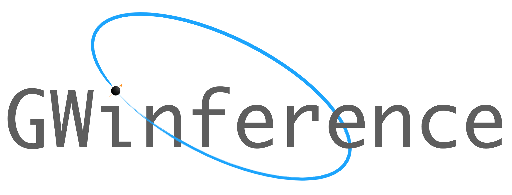

------

#### NOTE: this repository is not being developed. Please use the [`Bilby`](https://git.ligo.org/lscsoft/bilby) package to satisfy all your Bayesian inference/GW-parameter estimation needs.

Welcome to the GWInference online backup. GWInference is a lightweight, yet powerful, pure python gravitational-wave parameter estimation code based around the `emcee` python package created by [Foreman-Mackey, et al. (2013)](https://arxiv.org/pdf/1202.3665.pdf).

### Useful Information

If this is your first time using git (or even if it isn't) you may want to check out some of the git tutorials on [Atlassian](https://www.atlassian.com/git).

To get access to the code just clone the repo using:

```
git clone git@git.ligo.org:marcus.lower/GWInference.git
```

For more information on	`emcee` and how it works checkout the [website](http://dfm.io/emcee/current/#).

This code requires the [LAL](http://software.ligo.org/docs/lalsuite/lal/group__lal__python.html) and [LALSuite](http://software.ligo.org/docs/lalsuite/lalsuite/) packages to be installed.

### Getting Started

There are two ways to run this code on your own system: 
1. Using mpi4py to distribute a run over multiple CPUs, e.g. `I_MPI_SHM_LMT=shm mpirun -n 6 python GWInference_MPI.py`
2. Using HTCondor to run multiple instances at once on multiple nodes.

To set-up a large Condor run, go into the `condor.sub`, `bash_workaround.sh` and `makedag.pl` files and change the directory paths from `/home/marcus.lower/GWInference` to `/path/to/directory/GWInference`. 

For more information on how to use Condor, refer to these handy tutorials by [Eric Thrane](http://users.monash.edu.au/~erict/Resources/condor/) and [Sylvia Biscoveanu](http://users.monash.edu.au/~erict/Resources/condor/MyFirstCondor/your%20first%20condor%20submission.html).

**[The following will be made easier in a future update:]**

The injected waveforms that parameter estimation is carried out on are created by `createInjection.py`. It is currently set up to generate Fourier domain waveforms using the `EccentricFD` approximant with the component masses, eccentricity, distance, sky-location, polarisation angle and epoch specified in `inj_parameters.txt`. A different waveform approximant can be swapped in by changing the parameters and specified approximant in the `make_waveform` function of `createInjection.py`.

One could also write a separate script following the advice in the [CBC wiki](https://www.lsc-group.phys.uwm.edu/ligovirgo/cbcnote/Waveforms) or [pyCBC documentation](https://ligo-cbc.github.io/pycbc/latest/html/waveform.html)

Alternatively, if you have access to MonashGWTools, waveforms can be generated using the `waveform.py` script.

These last two methods will also require altering or removing the following line in `bash_workaround.sh`:
```
/path/to/python/bin/python /path/to/directory/GWInference/createInjection.py -f $job
```

In addition, modifications will have to be made to `GWInference_condor.py`/`GWInference_MPI.py` and `combineResults.py` for carrying out PE using non-eccentric approximants and other parameters (e.g. tidal effects or spin).
